# Exno:1
Data Cleaning Process
## Reg No: 212223230073
## Name: HarishKumar R

# AIM
To read the given data and perform data cleaning and save the cleaned data to a file.

# Explanation
Data cleaning is the process of preparing data for analysis by removing or modifying data that is incorrect ,incompleted , irrelevant , duplicated or improperly formatted. Data cleaning is not simply about erasing data ,but rather finding a way to maximize datasets accuracy without necessarily deleting the information.

# Algorithm
STEP 1: Read the given Data

STEP 2: Get the information about the data

STEP 3: Remove the null values from the data

STEP 4: Save the Clean data to the file

STEP 5: Remove outliers using IQR

STEP 6: Use zscore of to remove outliers

# Coding and Output
## Dataset.csv
```py
import pandas as pd
df=pd.read_csv("/content/Data_set.csv")

```
df.head(5)

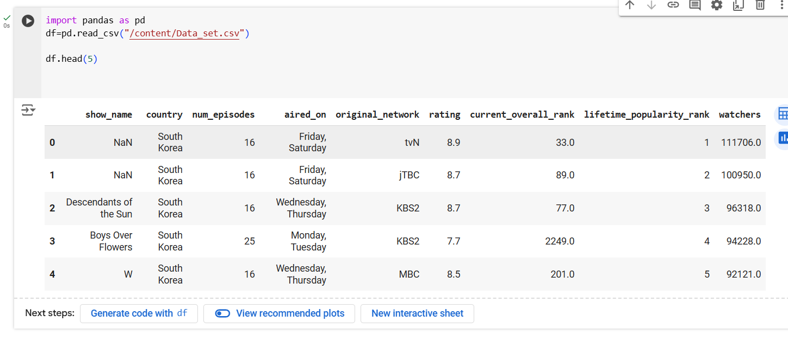

df.tail(3)


df.info()
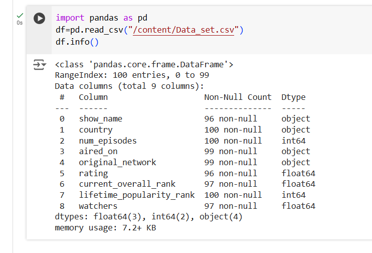

df.describe()
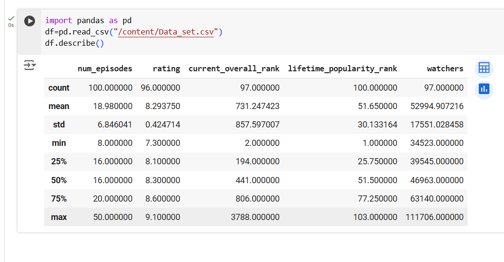

df.isnull()


df.notnull()


df.dropna(axis=1)


dfs=df[df['rating']>8]
dfs


df.iloc[[1,3,6],[1,4]]
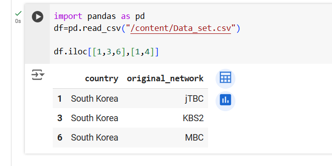

df=df.fillna(0)
df


## Height.csv
```py
import matplotlib.pyplot as plt
import pandas as pd
import numpy as np
import scipy.stats as stats
dataset=pd.read_csv("heights.csv")
dataset
```
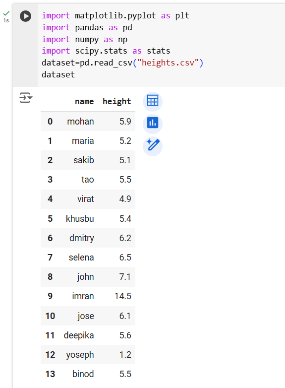
```py
df = pd.read_csv("heights.csv")
q1 = df['height'].quantile(0.25)
q2 = df['height'].quantile(0.5)
q3 = df['height'].quantile(0.75)
iqr = q3-q1
iqr
```


```py
low = q1- 1.5*iqr
low
```
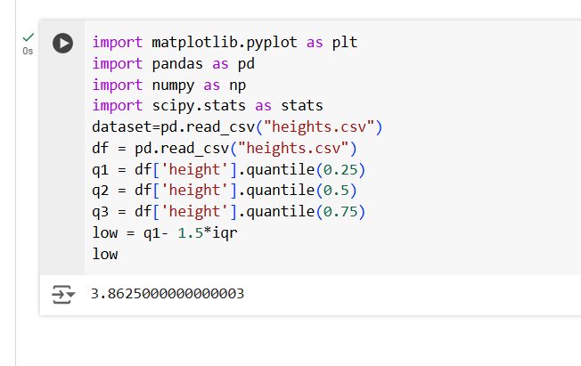
```py
high = q3 + 1.5*iqr
high
```


```py
df1 = df[((df['height'] >=low)& (df['height'] <=high))]
df1
```


```py
z = np.abs(stats.zscore(df['height']))
z
```
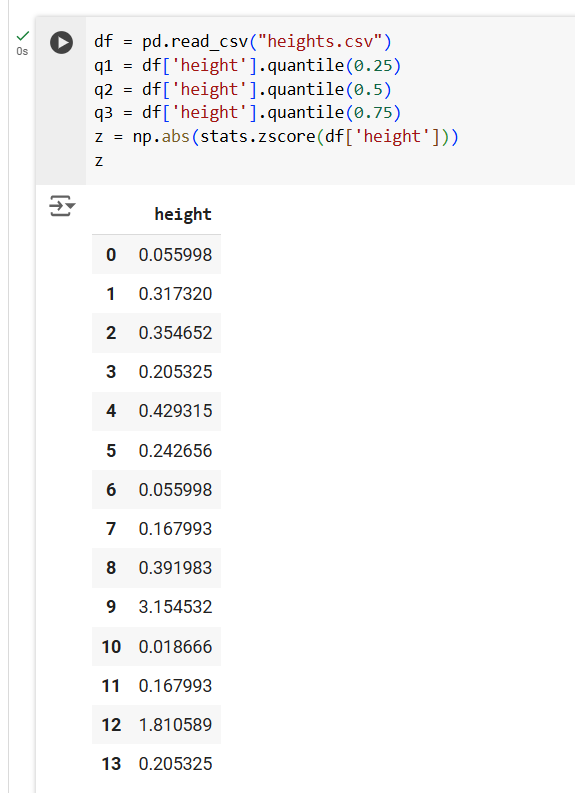

```py
df1 = df[z<3]
df1
```
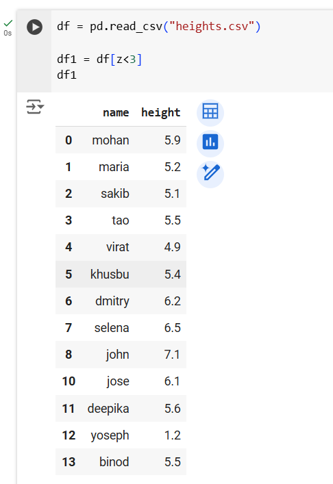

## IQR 
```py
ir=pd.read_csv('iris.csv')
ir
```
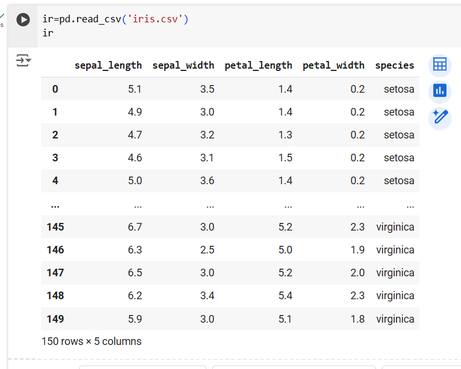
```py
ir.describe()
```

```py
import seaborn as sns
import matplotlib.pyplot as plt
sns.boxplot(x='sepal_width',data=ir)
plt.show()
```
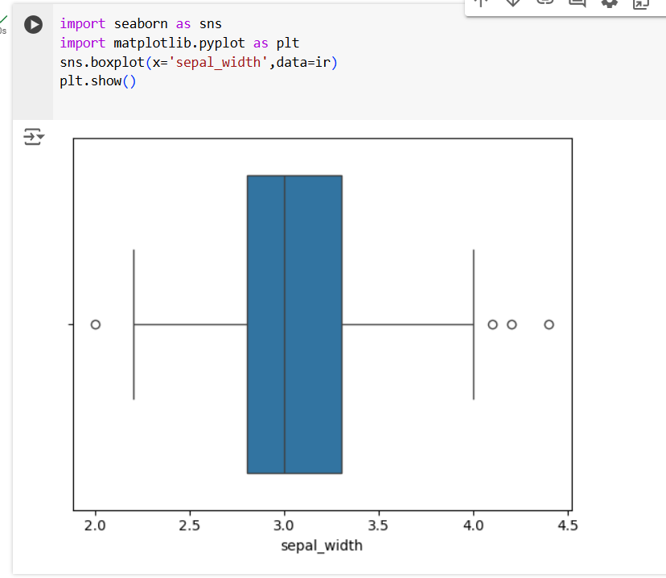
```py
 c1=ir.sepal_width.quantile(0.25)
 c3=ir.sepal_width.quantile(0.75)
 iq=c3-c1
 print(c3)
 ```
 
 ```py
 rid=ir[((ir.sepal_width<(c1-1.5*iq))|(ir.sepal_width>(c3+1.5*iq)))]
rid['sepal_width']
```

```py
delid=ir[~((ir.sepal_width<(c1-1.5*iq))|(ir.sepal_width>(c3+1.5*iq)))]
delid
```


```py
import pandas as pd
import seaborn as sns
import numpy as np
age=[1,3,28,27,25,92,30,39,40,50,26,24,29,94]
af=pd.DataFrame(age)
af
```
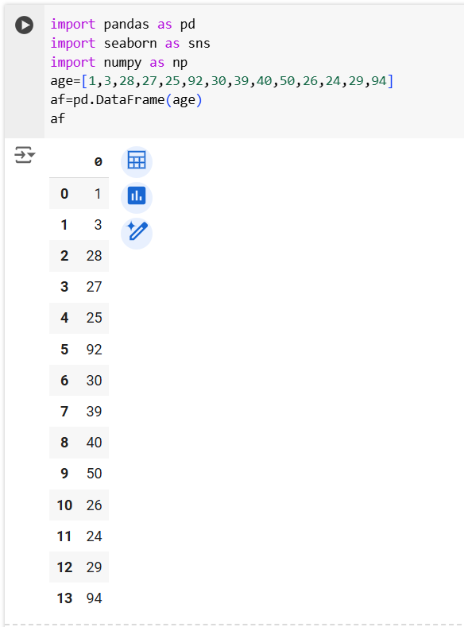


```py
import pandas as pd
import seaborn as sns
import numpy as np
sns.boxplot(data=af)
```
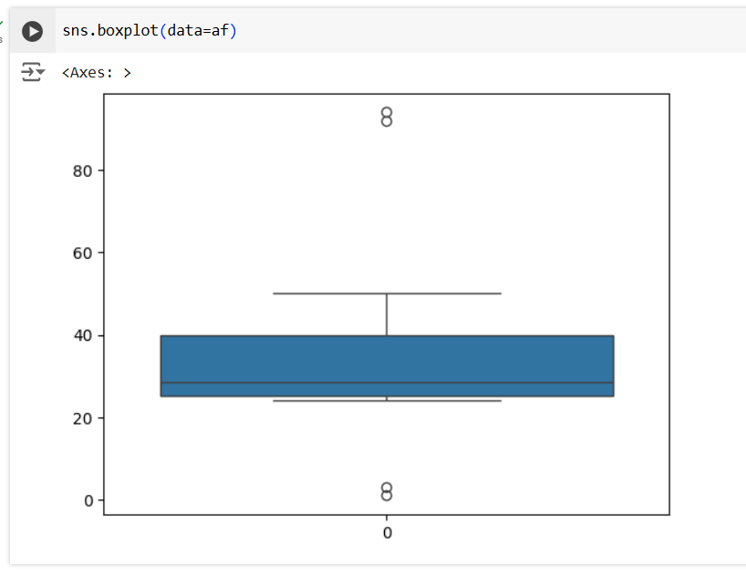
```py
import pandas as pd
import seaborn as sns
import numpy as np
sns.scatterplot(data=af)
```
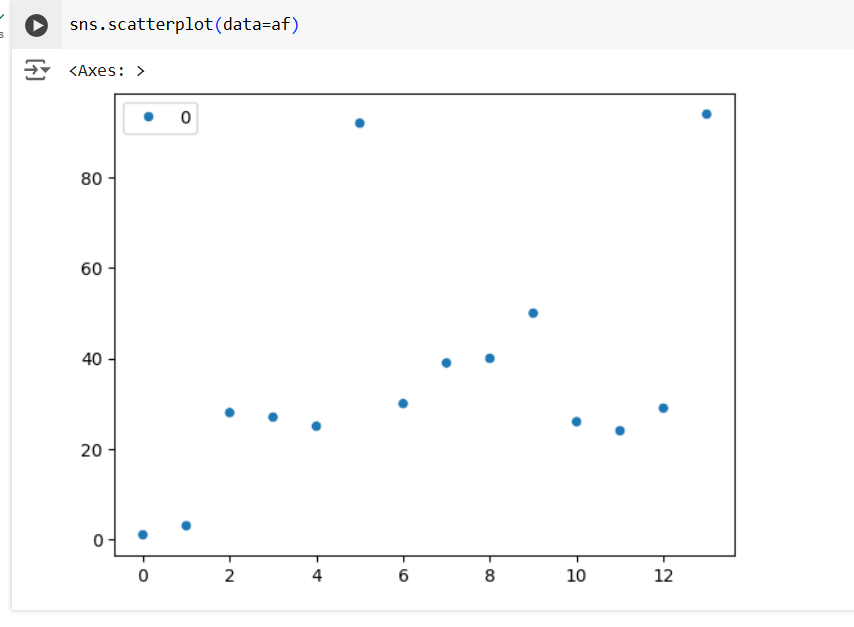
```py
import pandas as pd
import seaborn as sns
import numpy as np
Q1=np.percentile(af,25)
Q3=np.percentile(af,75)
IQR=Q3-Q1
print(IQR)
```

```py
import pandas as pd
import seaborn as sns
import numpy as np
print("Q1:",Q1)
print("Q3:",Q3)
low_bound=Q1-1.5*IQR
high_bound=Q3+1.5*IQR
out=[x for x in age if x<low_bound or x>high_bound]
print("Lower Bound :",low_bound)
print("High Bound:",high_bound)
print("Outliers:",out)
```
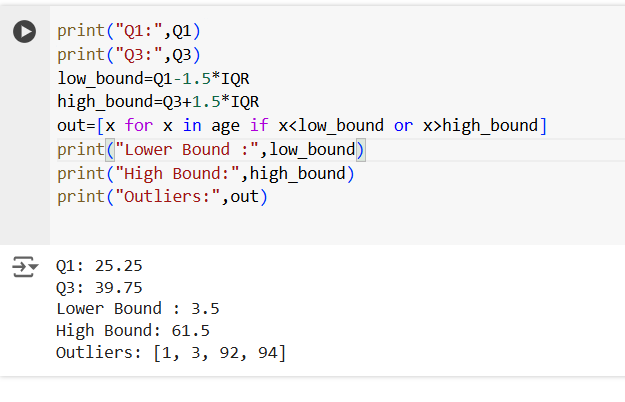


# Result
    Hence,The program was executed successfully.
